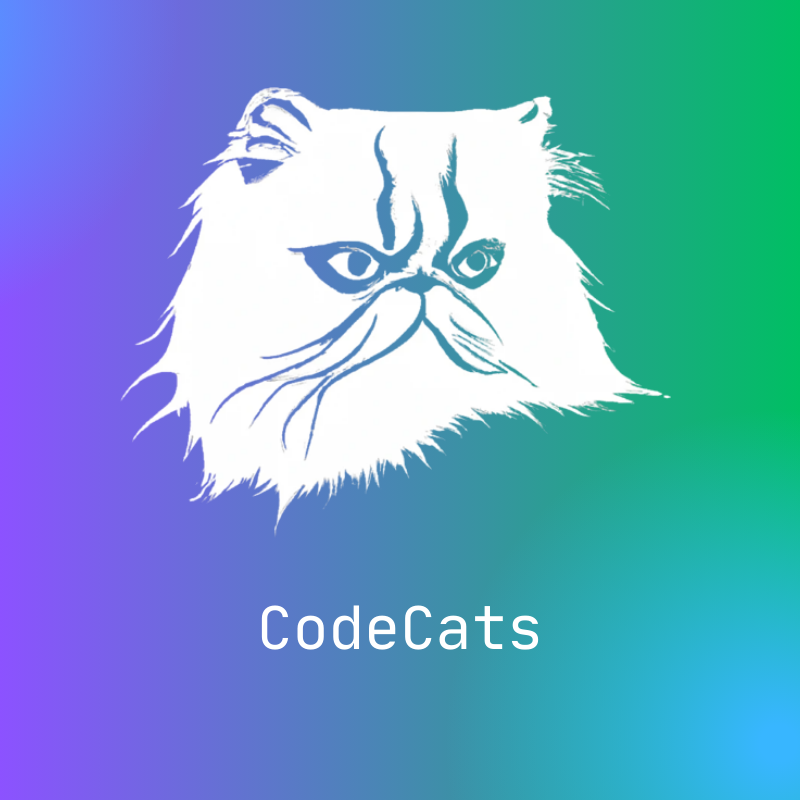

# CodeCatsCSS

CodeCatsCSS is a Visual Studio Code extension that provides a collection of CSS snippets to improve productivity in front-end development.

## Functionalities

- Comprehensive set of CSS snippets for common styling tasks.
- Seamless integration with Visual Studio Code for a fluid development experience.

## Installation

1. Open Visual Studio Code.
2. Go to the extensions section (Ctrl+Shift+X or Cmd+Shift+X on Mac).
3. Search for CodeCatsCSS.
4. Click "Install".

## Usage

1. Open a CSS file in Visual Studio Code.
2. Start typing a prefix related to the snippet you want to use.
3. Select the desired snippet from the list of suggestions and press Enter.

## Snippet

|        Triggers | Content                                                           |
| --------------: | ----------------------------------------------------------------- |
|        `init →` | Creates an **Init** for the CSS                                   |
| `flex-center →` | Create a basic layout with **Flex**, with everything **Centered** |
|    `media768 →` | Creates the basics needed for **Responsiveness**                  |

## Licença

Distribuído sob a licença MIT. Veja `LICENSE` para mais informações.
